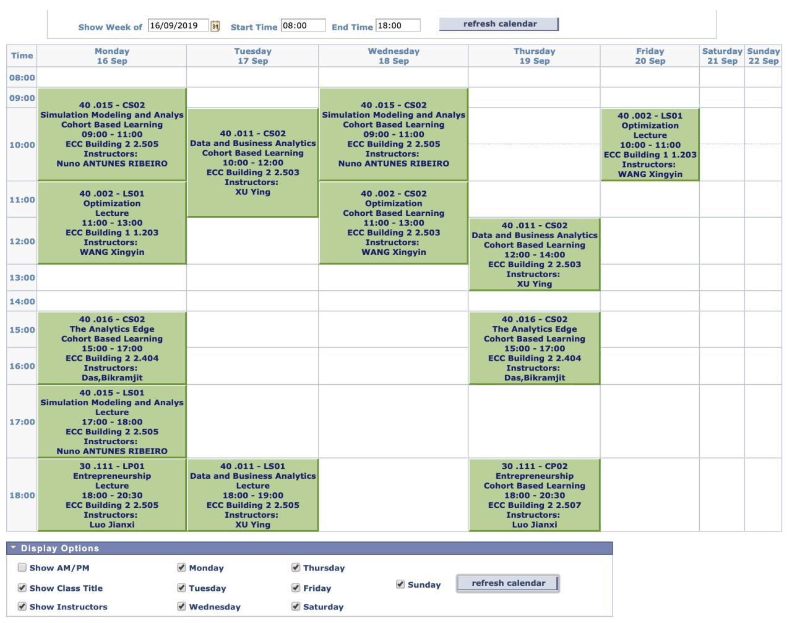
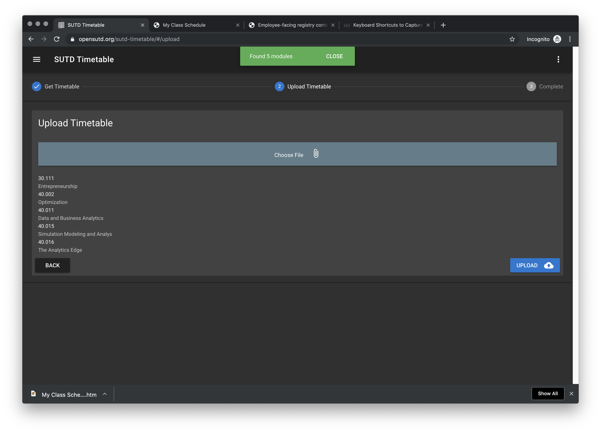
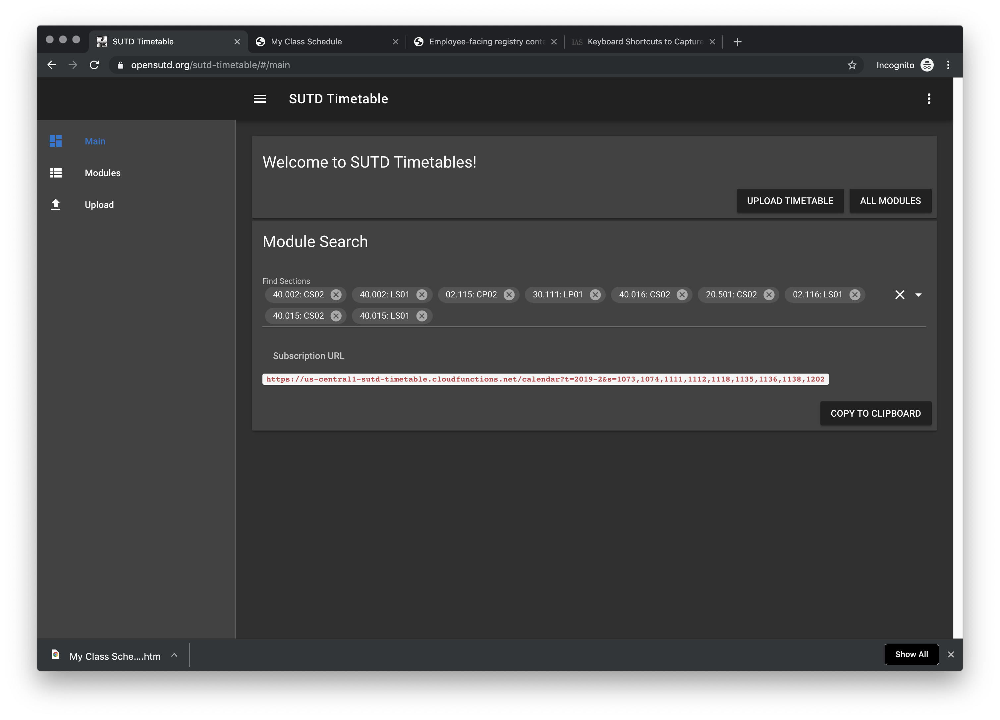
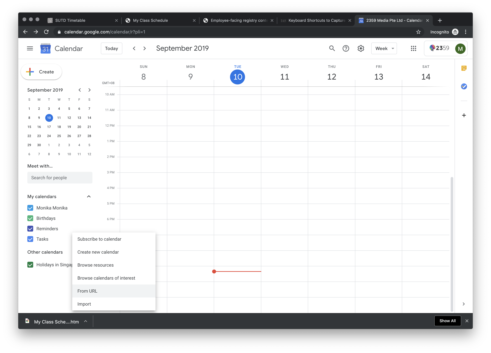
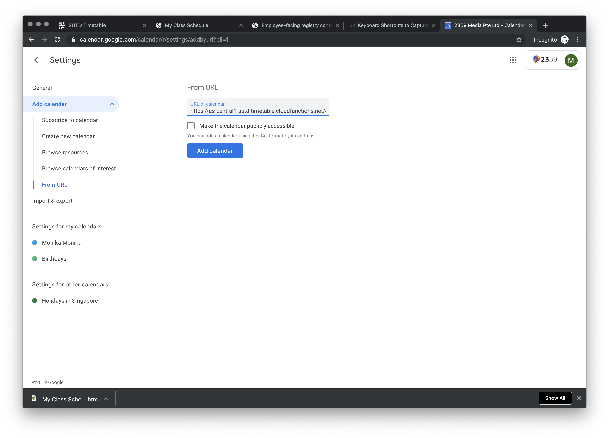
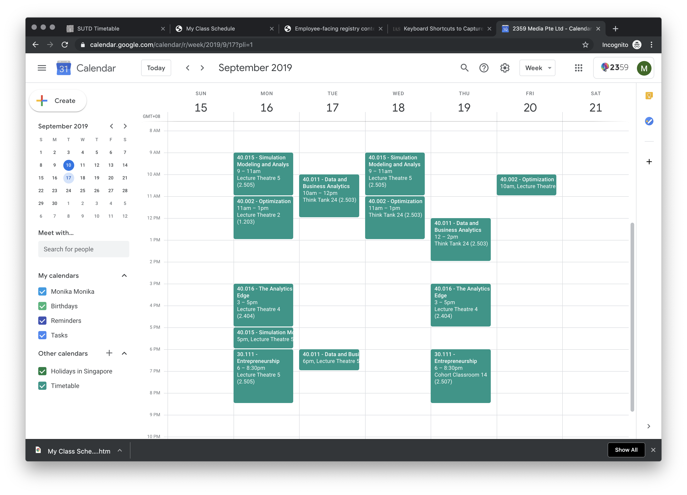

# Guide to using SUTD timetable
Accurate as of this [commit](https://github.com/OpenSUTD/sutd-timetable/tree/6b1ee446136b87f63494b18962f7fdd8029e2b6d)

**Purpose.** After your courses have been confirmed, the school provides a timetable. It looks like this with a very disproportionate size.

A very disproprotionate timetable <b>(click me to expand the image)</b>

  

The timetable provided is inaccurately embedded in the table. Porting the timetable to Google Calendars is troublesome, and you need to see how packed is your hectic schedule in SUTD.

There are two parts to using this app 

- Uploading your timetable from SUTD MyPortal to the app
- Downloading your timetable from the app to Google Calendars

## Uploading your timetable

Please search if your module has already been uploaded on the main page https://opensutd.org/sutd-timetable/#/main. You do not need to upload your timetable if your module has already been uploaded.

Check if your calendar has already been uploaded

  

If your timetable has indeed not been uploaded, please go to the [upload page](https://opensutd.org/sutd-timetable/#/upload). Log in to SAMS (which is the school admin management system).

When you are logged in, you will be presented with a blank screen. 

Then, go to the page with your [classes](https://sams.sutd.edu.sg/psc/CSPRD/EMPLOYEE/HRMS/c/SA_LEARNER_SERVICES.SSR_SSENRL_LIST.GBL) (which is the URL of the "Right Click and Save" button). 
Right-click, Save As, as a complete webpage.

Save as a complete webpage

  

Then back at https://opensutd.org/sutd-timetable/#/upload go to the next tab and upload the file. This is how a successful file upload looks like:

Successful file upload

  

Your file will be present in the system once uploaded.

## Downloading your timetable

Let's say you found all your courses. Copy the subscription URL.

Copy subscription URL

  

Log in to your Google Account and go to Google Calendar. Under other calendars, click on the plus sign and click "From URL"

Upload calendar

  

Paste the subscription URL to the URL of calendar.

Paste subscription URL

  

Your calendar is now on Google Calendar.

Timetable on Google Calendar

  

